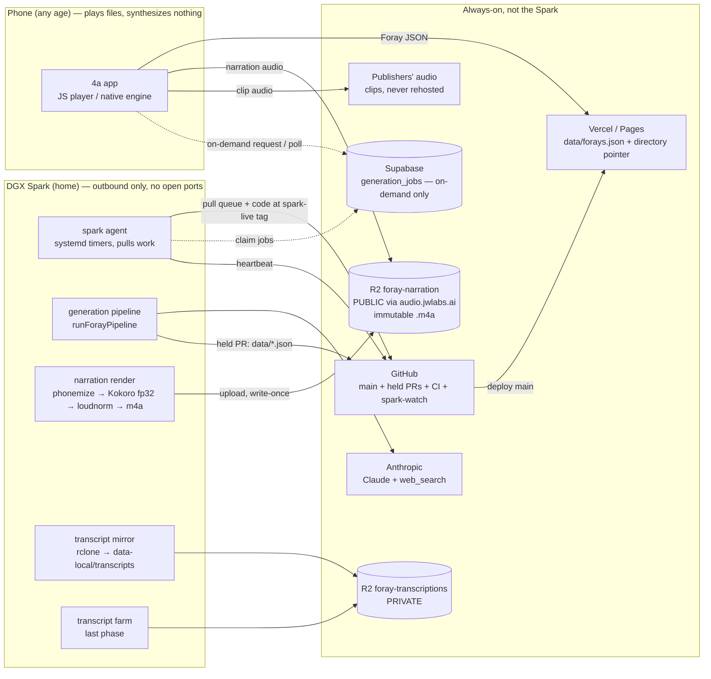

# Assessment: all Foray generation and narration rendering on the DGX Spark, narration streamed to the app

Status: **assessment for founder review (2026-09-27). Nothing here is decided until the founder rules on §6/§7.**
Read on `origin/main` @ 5645fce6 plus `origin/engine/m2`. Synthesized from six lens reviews
(generation, narration audio, app/player, data/publish/CI, ops/roadmap, on-demand). Where the lenses
disagreed, §3.0 records how it was resolved.

What triggered it, in the founder's words (2026-09-27): *"I'm actually very worried about trying to run on
old phones and so on, so just fetching audio is likely way better. Let's make a full assessment of
everything that would change, since probably all foray generation will be on the spark."* And earlier:
*"we set up an API for the spark, where the app sends the prompt to the API and the spark returns the
foray … could we still start forays while they're being generated"*.

---

## 1. Executive summary

**The short answer: yes, and it is less work than it sounds.** The app can already play narration from a
file. It has just never been given one. On every platform, a narration line that has an `audio_url` is
loaded and played like a podcast clip. Only a line with a script and no file is spoken on the phone:

- JS player: `player/queue-manager.js` `_isSynthNarration()`; `player/foray-queue.js` prefers `audio_url ?? asset`.
- Native engine on `engine/m2`: `EngineInput.swift` `isSynthNarration`.

The checker already accepts `audio_url` (`tools/foray/check-forays.mjs` `NARRATION_VOICE_FIELDS`). New
Foray data reaches phones without a store build (`player/foray-directory.js`). So **the first Heart-narrated
Foray can play on the TestFlight build you already have**, once three things are done: the audio is
rendered, it is uploaded to a public R2 bucket, and one data PR stamps the file links in.

**What changes**
- Narration is rendered once, centrally, by Kokoro on the Spark (Heart by default, Echo too). It is stored
  as small audio files (about 7 MB per voice per Foray) in a new public Cloudflare R2 bucket, and phones
  stream it the same way they stream clips.
- The generation pipeline moves off your Windows PC and onto the Spark: transcript mirror, curation run,
  render, and the "publish → held PR" step. It runs as a background service that *pulls* work. Nothing on
  the internet can reach into the box.
- Your "Spark API" idea becomes a job queue: the phone writes a request to Supabase, the Spark picks it up,
  and the finished acts plus their audio go to R2. Playback never depends on the Spark being up.

**What gets simpler**
- Nothing heavy runs on old phones. Narration no longer stalls or crashes on the device, and the Foray
  clock becomes exact because narration lengths are measured instead of estimated.
- The native engine gets easier: narration becomes an ordinary audio item, and the speech engine is only
  the fallback.
- The app shrinks from about 330–420 MB (TestFlight, with bundled voice models) back to tens of MB, which
  lifts the cellular-download cap problem.
- Pronunciation fixes, new voices (British, KV-11) and voice upgrades become a re-render on the Spark,
  with no app build.

**What gets deleted or parked**
- All on-device Kokoro work: the probes, the 325 MB fp32 and 82 MB Core ML model bundling, ONNX Runtime in
  the app, and most KV-*, S2–S6 and K-* cards (§4). The probe code comes out only after you have heard
  rendered narration in the car.
- The ElevenLabs-era `tools/narrate/` adapter. Its cache-key rules are reused.
- `backend/src/generation/phonemize.ts`, which is unwired.

**What it costs.** Estimates only; nothing keyed has ever been billed.

| | 1,000 Forays | 10,000 Forays |
|---|---|---|
| Narration storage (Heart + Echo, ~14 MB per Foray) | ~14 GB, about $0.10–0.20/month | ~140 GB, about $2/month |
| Downloads (R2 egress) | $0 | $0 |
| Render compute on the Spark | seconds to minutes per Foray, fractions of a cent | ~$5–10 of electricity in total |
| Spark electricity (always on) | about $4–9/month | same |
| **Claude calls to write the Forays** | **about $1–4k in total** (~$1–4 per Foray) | **about $10–40k in total** |

The audio decision is effectively free. **The real money is the LLM.** Today it costs nothing only
because Claude Code sessions answer the calls by hand through the relay. That works for the catalogue, but
it cannot serve on-demand requests.

**Top risks**
1. **A narration file that fails to load does not fall back to speech today.** On a line between two
   clips the player skips it. On a Foray's first line, or a line you jump to, it **stops**
   (`queue-manager.js` `_advancePastBridgeFailure` and the `_loadItem` catch → `E.error`). So stamp audio
   on drafts first, and publish rendered Forays only after the "speak the script instead" fallback ships
   in a build.
2. **Gaps at the seams.** The web lane does not preload the next file, so each narration line loads cold,
   and a hidden WebView has taken up to 9 s. Native M2 has preroll. Add a narration prefetch.
3. **The Spark holds real credentials** (R2 write, GitHub PR, Claude login or API key) while running repo
   code, and `tools/` auto-merges unread. Deny-list the Spark's scripts, deploy the Spark from a tag that
   only a human moves, never attach a self-hosted GitHub runner to this public repo, and keep tokens
   least-privilege.
4. **aarch64 and Blackwell software gaps.** The GPU builds of faster-whisper and onnxruntime have no ARM
   wheels, and Kokoro's fp16 build produced NaN on ARM. Render in fp32 (CPU is fine) and reject NaN or
   silent output. Joey's benchmark settles GPU versus CPU.
5. **One box in a house.** If the Spark is down, *new* content waits, but everything already published
   keeps playing from R2.

**Decisions you need to make** (each has a recommended default):

| # | Decision | Recommended default |
|---|---|---|
| D1 | Reverse "narration is spoken on the device" (generation-architecture §1.2; DECISIONS 2026-09-12) and your 2026-09-26 "Don't render entire Forays" | **Yes.** Record it in DECISIONS (founder-merged). |
| D2 | Narration speed with rendered files | Render once at 1.0x and let the player speed narration to your listening rate (pitch preserved). This amends ruling 2026-09-24 #3. Do the S1 ear check first. |
| D3 | How the Spark calls Claude | **Now:** keyless relay answered by headless Claude Code on your subscription, $0 extra. **Later:** a capped API key when you want unattended daily runs or on-demand. |
| D4 | Voices | Render Heart and Echo for every item. Heart ships first with no app change; Echo arrives with the picker update. |
| D5 | Audio format | AAC in `.m4a`, 64 kbps mono (exact seeking and durations on iPhone). |
| D6 | Bucket and domain | New public bucket `foray-narration` at `audio.jwlabs.ai`. `foray-transcriptions` stays private forever. |
| D7 | Keep the `hold` label, so you review every catalogue Foray | **Yes.** |
| D8 | Who has hands on the Spark, and where it lives | Joey does physical care and OS upkeep under a runbook. You alone place the secrets. Agents change the box only via merged PRs plus a tag you move. |
| D9 | The on-demand "Spark API" | Build it as a queue (Supabase), founder-only first, whole-Foray then act-by-act (§2b). |
| D10 | Transcription (the transcript farm) | Moves to the Spark **last**, after narration and generation run cleanly there. It stays on Joey's rig until then. |
| D11 | Remove the bundled voice models from the app | Yes, in the first build after rendered narration passes your car listen. |

**Smallest first step** (Phase 1, §5). Create the bucket, domain and token. Render the three narrated
draft Forays in Heart. Land one data PR. Listen through the drafts switch. The render tool is
host-agnostic (CPU fp32), so this does not have to wait for the Spark to be racked.

---

## 2. Target architecture



Invariants:
- **Playback never touches the Spark.** The app reads JSON from Vercel/Pages, narration from R2 and clips
  from publishers.
- **The Spark only makes outbound connections.** It gets work from a queue file on `main` (catalogue) or
  a Supabase table (on-demand).
- **Narration objects are content-addressed and never overwritten**, so a phone holding stale data still
  plays.
- **Clip audio is never stored or served by 4a** (principle 3, ADR-0007/0008). The narration bucket holds
  only our own voice.
- **Every GitHub workflow stays on GitHub-hosted runners.** `ios-gate` and release must stay on macOS.

---

## 2b. The on-demand "Spark API" idea

**Does it make sense?** Yes, as a *shape*: the app sends a prompt, the Spark builds the Foray, and the app
plays it. Two parts of the literal version should change.

1. **The phone should not call the Spark directly.** A home box behind a tunnel returns errors whenever it
   is down, rebooting or on a changed ISP address, and it would become a public attack surface holding
   your keys. Put a queue in between. The app inserts a row into a Supabase `generation_jobs` table, which
   is already authenticated, already allowed by the app's CSP, and protected by RLS. The Spark *pulls*
   jobs outbound. If the Spark is down, jobs wait as "queued" instead of failing.
2. **The Spark does not "return" the Foray.** It publishes each act as it is ready: a private manifest in
   the job row, plus that act's narration files in R2. The app polls the row (or uses Supabase Realtime)
   and plays from R2.

```
phone ──insert job──► Supabase generation_jobs ◄──claim (outbound)── Spark worker
phone ◄─poll status/manifest── Supabase             Spark ──per act: render + upload──► R2 (audio)
phone ──stream audio──► R2 (narration) + publishers (clips)
```

**Can a Foray start while it is still generating?** Yes, act by act. Most of the backend half is already
built:

- `runForayPipeline` takes `onActReady`.
- `backend/src/generation/partialCandidate.ts` `buildPartialCandidate` emits a private, act-by-act
  `PartialCandidate`. Each act is validated by the same gates, judged against the projected whole.
- `backend/src/generation/generationStatus.ts` `readPartialCandidate` is the author-checked read path. Its
  header says *"There is no HTTP server anywhere in this repo"*, and the queue avoids needing one.

What is missing:
- **Player append.** `buildForayQueue` needs the whole item list, and neither the JS player nor the Swift
  engine contract has an append command.
- **A "waiting for the next act" state.**
- **An API key.** The relay is paced by a human session at 117–143 s per call
  (`docs/curation/latency-model-2026-09-10.md`), so it cannot serve a listener.

**Time to first audio.** Rendering adds seconds per act. The LLM sets the pace:

| | Act 1 playable | Whole Foray |
|---|---|---|
| Relay, measured | 18.1 min (attempt 5) | 76–91 min |
| Keyed API, estimated (latency-model §2.2) | about 3.5–9 min | about 9–22 min |
| After prompt caching and the other levers | about 1.5–3 min | — |

Under 60 s needs the G-38 act-1 fast path, a founder ruling that bends the frozen-spine rule. The honest
UX is "we'll have it ready in a few minutes": a card that flips to **Play**, not a spinner in front of the
button.

**If an act is late or fails:**
- **Late:** the player reaches the last ready item, pauses with "Building the next part…" on screen and
  the lock screen, and resumes by itself. Acts are narrated in parallel (`writeNarration.ts`
  `DEFAULT_NARRATION_ACT_CONCURRENCY = 4`), so act 2 should normally be ready well inside act 1's ~10
  minutes of listening.
- **A single line fails to render:** that line is spoken from its script on the device (the fallback,
  §3.3).
- **An act fails:** the run is refused (`RefusedPartialError`) or hits its budget. The Foray ends
  gracefully at the last finished act, and spend stays under `EPISODE_BUDGET_USD`.

**Cost: on-demand versus catalogue.** Each Foray costs the same to make, about $1–4 in Claude calls plus
cents of audio. The difference is who it serves. A catalogue Foray is made once and heard by everyone. An
on-demand Foray is made for one listener. At 1k listener requests a month that is about $1–4k a month.
Before this opens beyond the founders it needs per-user quotas, cancel-on-abandon, dedup of similar
prompts (§9.6, never ruled), and a global daily cap. The last one matters because today's
`BudgetGuard` ledger is in-memory per process (`backend/src/cost/costEvents.ts`
`InMemoryCostEventSink`), so N workers would mean N × the daily cap.

**Scale limits of one box.** With Claude as the model, the Spark is mostly waiting on the network. Each
worker runs one Foray per process (`usageTracking.ts` counts per process). Rendering is seconds. So the
real limits are Anthropic rate limits and your spend, not the Spark: tens of concurrent Forays is
plausible, though unmeasured. A **local** LLM would flip that, making the Spark the bottleneck. By
estimate that is about 1–10 Forays a day on GB10's memory bandwidth, with web search lost and quality
unproven. That option is parked (§3.6).

**Staged path:**

| Stage | What | Gate |
|---|---|---|
| S0 | One keyed batch run (G-20). Every timing number so far comes from the relay, and F-47 truncation has never been exercised on a real key. | API key with spend cap (human) |
| S1 | Founder-only queue plus Spark worker, **whole Foray**. You tap Create, a card says "building", and it flips to Play at the end (est. 9–22 min). No player change needed beyond reading a private manifest. | Supabase migration (human), worker in `backend/src` (founder-approved) |
| S2 | Act-by-act streaming in the **JS player** (append + waiting state). | S1 running |
| S3 | Native engine append. **After** M2 merges, never folded into the car-test build. | M2 merged |
| S4 | Listener-facing. Needs App Store Guideline 1.2 (filter, report, block, contact), quotas, dedup and push (#761). | product ruling |

---

## 3. Change inventory

Effort: S (hours), M (a day or two), L (several days), XL (a multi-card package).
**DENIED** means the path is in `tools/ci/path-policy.mjs` and needs `founder-approved`.

### 3.0 Where the lenses disagreed, and the resolution

| Topic | Positions | Resolution |
|---|---|---|
| Audio format | AAC `.m4a` (narration-audio, app-player) vs 64 kbps MP3 (data-publish, ops; `docs/narrator-pipeline.md` §2.5) | **AAC-LC `.m4a`, 64 kbps mono, 24 kHz, faststart.** MP4 has a sample table, so AVPlayer seeks exactly, and an edit list trims encoder priming, which keeps `duration_sec` true. MP3 remains a one-field profile change if anything fails to play it. |
| Synthesis engine | PyTorch on GPU in an NGC container vs ONNX Runtime fp32 on CPU | **Start with ORT fp32 on CPU**, the same graph and pinned bytes as `fetch-models.mjs` (325,532,232 B), with zero new provenance. Add GPU only if the bench shows CPU is too slow. **Never q8f16/fp16 on ARM** (NaN, kokoro plan §10b). |
| Where rendering sits | A reconciler over `data/forays.json` vs a new `runPipeline.ts` stage | **Phase 1: a separate step after generation** (generate → render → publish), with no `backend/src` change. It also backfills existing Forays. A pipeline stage is built only for on-demand (act-by-act audio). |
| Data shape | Flat `audio_url` vs a per-voice map vs `text_sha` + derived URL | **`audio_url` + `duration_sec` + `duration_source:"measured"` for Heart** (installed builds play it unchanged), plus `voices.am_echo.{audio_url,duration_sec}` and `render.{profile,script_sha}`. Objects are keyed by a hash of **phonemes + render profile**. CI checks `script_sha` against `billableText(script)` (offline), which catches a script edited after its render. |
| What happens on load failure | "skipped" vs "stops" | Both are true (read in `queue-manager.js`): a *bridge* line is skipped (`_advancePastBridgeFailure`), and a line reached through `_loadItem` raises `E.error`, which stops the player. The fallback card fixes both. |
| Transcript farm | Move to the Spark vs stay on Joey's rig | **Move last** (D10). It is GPU-heavy and has weeks of backlog, so avoid contention until narration and generation are stable. |
| LLM transport | Headless Claude Code relay vs API key | **Relay for the catalogue now** (matches "API key comes LAST"). **The key is required for on-demand and for unattended daily cadence.** |
| Catalogue front door | Queue file on `main` vs Supabase | **Both**, for different jobs: `data/generation-queue.json` on main for catalogue and backfill work; Supabase `generation_jobs` for on-demand. |
| Deploy source on the Spark | `origin/main` vs a human-moved `spark-live` tag | **The tag.** Combined with a DENY on `tools/spark/`, an auto-merged `tools/` PR can never run with the Spark's credentials until a human moves the tag. |
| Bucket and domain names | `foray-narration` / `foray-media`; `audio.` / `media.` / `narration.jwlabs.ai` | **`foray-narration` at `audio.jwlabs.ai`**, which must be in the same Cloudflare account as the zone. A separate private `foray-ops` bucket holds backups. |
| Narration size | ~3.7 MB vs ~6.9–7.7 MB per voice per Foray | Measured data (157 items, 55,538 chars over 4 narrated Forays, read from `data/forays.json`) gives about 13.9k chars ≈ 14 min per Foray, so **≈ 7 MB per voice at 64 kbps**. |

### 3.1 Generation

| Change | Files | Kind | Effort | Risk |
|---|---|---|---|---|
| Pipeline code unchanged in phase 1. The Spark chains `start-run.mjs` → `generateForays.ts` → render → `publishForay.ts` (which keeps `--hold`). | `backend/src/generation/runPipeline.ts`, `backend/src/cli/generateForays.ts`, `backend/src/cli/publishForay.ts` | unchanged-but-verify | S | Check that `git fetch`, the branch cut and `gh pr create` work from the Spark clone with the bot token. |
| Headless relay answerer: `claude -p` answers parked requests in `data-local/relay/queue`. Also: `start-run.mjs` skips the relay when a real key is present. | `tools/generation/answer-relay.mjs` (new), `tools/generation/start-run.mjs`, `tools/generation/relay.mjs` | add/change | M | Subscription usage limits stall runs silently (a 7 h outage has happened). Needs the heartbeat (§3.5). |
| Transcript corpus mirror: read-only rclone sync of `foray-transcriptions` into `data-local/transcripts`, then `warm-transcript-index.mjs`. Replaces the undone "R2-backed TranscriptCueProvider" with no backend code. Add a body-count guard (I-24). | `tools/spark/sync-transcripts.sh` (new), `tools/generation/warm-transcript-index.mjs` | add | S | The bucket stays private. The 16 GB per-show indexing limit in `warmTranscriptIndex.ts` disappears on 128 GB. |
| Nightly judgement step (#760 / HA #46) as a Spark timer at about 09:00 UTC, running `docs/agents/runner-prompts/foray-nightly.md`. | `tools/spark/systemd/nightly-enrich.*` (new), `docs/agents/runners.md` | change | M | Needs the one-time ruling on the stranded 2026-09-14 digest first. `nightly-watch.yml` already detects a missing PR. |
| Keep keyless deterministic jobs on GitHub: `nightly-refresh.yml`, `shows-import.yml`, `pages.yml`, releases, CI. | `.github/workflows/*` | unchanged | — | Moving them would only add failure points. |
| Transcript farm onto the Spark (last phase): whisper.cpp with CUDA, or CTranslate2 from source (the PyPI GPU wheel is x86_64-only). Re-run its self-benchmark. Same R2 layout. | `JW-Incorporated/transcript-farm` (requirements, bootstrap, `docs/SETUP-LINUX.md`), `tools/transcribe/bench_whispercpp.py` | change | L | CUDA 13 / sm_121 support is unverified. Rendering and generation must get priority over it. |
| Latency and cost levers for keyed runs: prompt caching, effort settings, merged select+prose. No `cache_control` exists in `backend/src` today (grep). | `backend/src/generation/Anthropic*Builder.ts`, `anthropicCall.ts` | change (DENIED) | M | Verifier quality; gate on `meta.veracity` with `tools/generation-bench`. |

### 3.2 Narration audio

| Change | Files | Kind | Effort | Risk |
|---|---|---|---|---|
| Render tool. For each narration item: `phonemize.py` (lexicon → misaki → espeak-ng), `sentence_chunks()`, Kokoro-82M **fp32** with voices af_heart and am_echo (pin Echo's sha256 from #844), then reject non-finite, silent, or out-of-band output (rendered/estimated length within [0.5, 2.0]). Then trim lead and tail silence, join chunks with a 0.08 s gap, pad 0.5 s at each end, and apply one calibrated gain per voice to −16 LUFS as heard (−19 LUFS integrated on the mono file) with true peak ≤ −1 dBTP. Encode AAC `.m4a` 64 kbps. Measure `duration_sec` from PCM. Upload write-once (`If-None-Match: *`, HEAD-verified). Stamp the item and restate `runtime_sec`. Supports `--backfill` over `data/forays.json`. Host-agnostic, so it runs on the PC too. | `tools/narration/render-foray.mjs` + `render.py` (new, from `render-audition.py`), `tools/narration/render-profile.json` (new), `tools/narration/phonemize.py`, `requirements.txt`, tests + floor in `test/suite-integrity.test.js` | add | L | Voice drift: you chose Heart/Echo from q8f16-on-x86 renders, and fp32 is the same voice but not bit-identical, so an ear check gates it. The two writers of `data/forays.json` must stay separate: the render PR touches only narration audio fields and rebases on main. |
| Fix phonemize/render debts: the `--json -` stdin defect; `render-audition.py` should import `sentence_chunks` instead of its own `split_phonemes`, and read the fp32 pin. | `tools/narration/phonemize.py`, `tools/narration/render-audition.py` | change | S | — |
| Content-hash keys: `n/<profileId>/<voice>/<sha256(phonemes-as-chunked + profileId)>.m4a`, plus a per-voice `preview.m4a`. Headers: `Cache-Control: public, max-age=31536000, immutable`, `Content-Type: audio/mp4`. CORS: GET/HEAD. Never delete an object in v1. | `render-profile.json`, `docs/narration-render.md` (new runbook) | add | S | Phones keep old directory sets indefinitely (IndexedDB), so deleting objects would break them silently. |
| Retire the ElevenLabs dry-run adapter. Keep `cache.mjs`/`billable.mjs` rules (`billableText` canonicalisation). | `tools/narrate/adapter.mjs`, `pricing.json`, `docs/narrator-pipeline.md` §2.5 | park | S | — |
| Pipeline render stage (on-demand only): render each act's lines before `onActReady` exposes the act. A failed line stays script-only and never blocks. | `backend/src/generation/renderNarration.ts` (new), `runPipeline.ts` | add (DENIED) | M | Serializes with other `runPipeline.ts` editors. |
| Optional QA: ASR round-trip of each rendered line (WER against the script), and a measure-and-discard clip-loudness survey to tune the target. | `tools/narration/qa-asr.py`, `tools/audio/clip-loudness-survey.py` (new) | add | M | The survey must discard audio (principle 3). |

### 3.3 App and player

| Change | Files | Kind | Effort | Risk |
|---|---|---|---|---|
| **Fallback:** if a rendered file fails to load, speak `script` with the system voice, and skip only if that also fails. JS first (`_loadItem` catch for kind tts, `_playTransitionBridge` catch), then parity fixtures, then EngineCore `onLoadFailure` on M2. Add a `narrationSource=file\|synth\|fallback` diagnostics row. | `player/queue-manager.js`, tests, `player/parity/fixtures`, `EngineCore.swift` (after M2) | change | M | Samantha sounds nothing like Heart, but that beats silence or a stop. **Must ship in a build before any *published* Foray carries audio.** |
| **Prefetch across narration seams:** warm the next narration file during a clip, and the next clip during narration. Today `EngineCore.warmNextSegment()` only prepares when the seam gap is above 0, and the web prefetch is parked. Optional iOS `NarrationCache` (download a Foray's narration up front, ~7 MB) makes those seams instant and offline-capable. | `player/seam-gap.js`, `player/queue-manager.js`, `EngineCore.swift`, new `NarrationCache.swift` | change/add | M | Deck-policy parity must be re-recorded. Hold until M2 merges. |
| **Rate:** rendered narration follows the listener's rate. Keep `resetRateForTTS` only for spoken lines (`queue-manager.js` `NARRATION_RATE = 1`). On M2 use `narrationFollowsListenerRate` (`EngineCore.swift` ~l.1969). AVDeck already uses `.timeDomain`. | `player/queue-manager.js`, `player/queue-state.js`, `EngineCore.swift`, parity fixtures | change | S | Waits on D2. Order: JS, re-record, then Swift. |
| **Voice picker:** Heart/Echo from the item's `voices` map. `cp_voice` becomes `kokoro:af_heart`/`kokoro:am_echo`. Preview plays `preview.m4a`. Apple voices become an invisible fallback only. | `player/foray-queue.js`, `player/client.js`, `player/default-voice.js`, `app.js` (`VOICE_ALLOWLIST`, `buildVoiceSheet`), `player/engine-contract.js` (audition url) | change | M | The Foray clock, strip and resume offsets must use the chosen voice's durations. |
| **Delete on-device Kokoro (iOS):** `KokoroOrtProbeEngine.swift`, `KokoroCoreMLEngine.swift`, `KokoroProbeMatrix.swift`, the probe in `ForayTtsPlugin.swift`, and the onnxruntime pin in `Package.swift` (DENIED). | `mobile/plugins/foray-tts/ios/…` | delete | M | Only after the car listen. The probe evidence stays in git history. |
| **Delete on-device Kokoro (Android/web):** `KokoroOrtProbeEngine.java`, `build.gradle` ORT (DENIED), `player/kokoro-probe.js` + test, probe entry points in `tts-bridge.js`, `foray-tts.js`, `client.js`, the `app.js` voice-probe drawer, `tools/mobile/probe/`. | as listed | delete | M | Also drop the diagnostics rows that read the probe. |
| **Drop model bundling:** `fetch-models.mjs` pins to `bundle:[]`, `inject-models.mjs`, the CI steps in `.github/actions/ios-archive` / `android-bundle`, and the size budgets in `test/release-gates.test.js`. All DENIED. | as listed | delete | S | Keep the GPL/espeak needle scan in release-gates. |
| **M2 (engine/m2): no scope added before the car test.** The rendered path already exists (`EngineInput.swift` `isSynthNarration`). The car test exercises speech, which remains the fallback. Afterwards, one re-drive of H5/H6 on a rendered Foray. | `docs/native-engine-plan.md` | unchanged-but-verify | S | Adding scope would invalidate the build under test. |
| **Append + waiting state** (on-demand S2/S3): `buildForayQueue({startIndex})` or rebuild-and-diff, and "Building the next part…" on the lock screen. Swift `appendForayItems` after M2. | `player/foray-queue.js`, `player/queue-manager.js`, `player/media-session.js`, `EngineCore.swift`, `ContractDecoding.swift` | change | L | iOS may throttle background polling while locked (unexamined). |

### 3.4 Data, publish and CI

| Change | Files | Kind | Effort | Risk |
|---|---|---|---|---|
| **check-forays rules:** `audio_url` must be https on the narration host with no token; `duration_sec` finite and > 0 with `duration_source:"measured"`; `script` still required; `voices` must name known ids; `render.profile` must match the committed profile; `render.script_sha === sha256(billableText(script))`. A published Foray with unrendered narration only **warns** in phase 1. D1 is evaluated on the per-voice maximum clock. | `tools/foray/check-forays.mjs`, `check-forays.test.mjs` | change | M | Must import `tools/narrate/billable.mjs`, never a second canonicaliser. |
| **Fixture before emit (G-21c):** commit a frozen fixture carrying rendered narration, and remove `narration.voice audio_url` / `duration_source measured` from `KNOWN_UNCOVERED`. | `tools/foray/fixture-coverage.test.mjs`, `tools/foray/fixtures/` | change | S | The F-89 lesson. |
| **Zod schema:** `ForayNarrationItemSchema` is `.strict()` and has no `audio_url`/`duration_sec`/`voices`/`render` (read in `backend/src/generation/forayItems.ts`). Needed only when the *pipeline* emits audio (on-demand). Phase 1 stamps audio after the pipeline, so it does not need this. | `backend/src/generation/forayItems.ts` | change (DENIED) | S | Every candidate fails if emitted before the schema changes. |
| **Real-data suites against a backfilled `data/`** before the first render PR: `publishSuites.ts`, `prepare-webdir` seed cap (44 KB; rendered fields add ~4–8 KB per narrated Foray, only published Forays go in the seed), `foray-playback.test.js` runtime within 1 s. | `backend/src/cli/publishSuites.ts`, `tools/mobile/prepare-webdir.mjs` (DENIED), `player/foray-playback.test.js` | unchanged-but-verify | S | `runtime_sec` must be restated in the same PR as the durations. |
| **No audio in git:** a guard that fails on `.mp3/.m4a/.wav/...` outside an allowlist (the interlude placeholder and the ClickTracks fixtures). | `test/` (new) | add | S | — |
| Publish-time network verifier, run on the Spark, never in required CI: 200 status, content type, bytes/sha, decoded duration within 50 ms, loudness, CORS. It also runs as a nightly canary. | `tools/foray/verify-narration-audio.mjs` (new, modelled on `verify-source-audio.mjs`) | add | M | Call it from a Spark wrapper, not from inside `publishForay.ts` (DENIED). |
| **CSP / service worker:** no change. `index.html` already has `media-src https:`, and `sw.js` ignores cross-origin and media requests. `connect-src` needs the narration origin only if audio is ever `fetch()`ed (download/cache on web). | `index.html`, `sw.js` | unchanged-but-verify | S | `index.html` is unlisted (human merge). |

### 3.5 Ops and security

| Change | Files | Kind | Effort | Risk |
|---|---|---|---|---|
| **Bootstrap + runbook:** service user, dedicated clone, Node 22 arm64, Python 3.12 via uv, espeak-ng, ffmpeg, gh, rclone, systemd units, unattended-upgrades, LUKS, Tailscale for admin SSH, no inbound ports. Includes a restore drill and wall-watt measurement. | `tools/spark/bootstrap.sh` (new), `docs/ops/spark.md` (new) | add | M | Idempotent, so the box is rebuildable ("cattle"). |
| **Pull agent:** systemd timers fetch the `spark-live` tag and read `data/generation-queue.json` (render backfill, generate→render→publish, transcript mirror, nightly enrich). Reports via PRs and one status issue. Never runs an unmerged branch. | `tools/spark/agent.mjs`, `tools/spark/systemd/*`, `data/generation-queue.json` (new) | add | M | Silent death looks like "nothing happened" (#290), hence the watch below. |
| **Path policy:** add `tools/spark/` (and the uploader) to `DENIED_PREFIXES`, on the same argument recorded for `tools/events-server.mjs` (unread code running with real privileges on a founder machine). Credentials live only in the uploader's own config (mode 600), never exported to processes running allowlisted code. | `tools/ci/path-policy.mjs`, `path-policy.test.mjs` | change (DENIED) | S | More human merges on Spark scripts, which is the point. |
| **No self-hosted runner** on this public repo. A workflow runs from the PR head before path-policy or review can stop it. | `.github/workflows/*` | unchanged | — | — |
| **Heartbeat + `spark-watch.yml`:** the Spark writes a secret-free heartbeat (build tag, last jobs, queue depth, disk, GPU temperature, render failures). An hourly keyless Action reuses `watch-release.mjs`'s sticky-issue logic: red if the heartbeat is older than 2 h, disk is under 15%, or a queued Foray has had no PR for 24 h. | `.github/workflows/spark-watch.yml` (DENIED), `tools/ops/spark-watch.mjs` (new) | add | S | — |
| **Backups:** nightly rclone of candidates, checkpoints and logs to a private `foray-ops` bucket. Secrets are escrowed in your password manager. | `tools/spark/backup.sh` (new) | add | S | — |
| **Docs of record:** DECISIONS entry (D1, D2), amendments to generation-architecture §1.2/§1.4/§4.7a/§6.3, a STATE workstream entry, Spark rows in `runners.md`, superseded banners on the KV, speed and bundled-voice decks. | `docs/DECISIONS.md` (DENIED), `docs/curation/generation-architecture.md`, `STATE.md`, `docs/agents/runners.md`, the voice decks | change | S | Until this merges, agents following the KV deck keep building on-device. |
| **Legal:** privacy-policy sentence that 4a's own narration is served through Cloudflare (IP and user agent, like any host). Update third-party notices: ORT, FluidAudio and the Core ML chain leave the app; Kokoro stays credited as a server-side model. espeak-ng (GPL) stays server-only, but the licence check required by generation-architecture §1.2.1 is still owed. | `docs/legal/privacy-policy.md`, `data-safety.md`, `third-party-notices.md`, `test/legal-citations.test.js` | change | S | Wording needs your approval. |

### 3.6 On-demand

| Change | Files | Kind | Effort | Risk |
|---|---|---|---|---|
| `generation_jobs` table: RLS for own rows, an allowlist (founders), a cap on active jobs, a `claim_job()` RPC using `FOR UPDATE SKIP LOCKED`, and the prompt nulled on claim (§9.4). | `backend/migrations/supabase/0004_generation_jobs.sql` (new) | add | M | Applying it to production is a human action. |
| Spark worker: claim → `runForayPipeline` with `onActReady` → render + upload per act → write the `PartialCandidate` into the row. Adds heartbeat, cancel between stages, outcome mapping, one Foray per process, and `FileCheckpointStore` resume. | `backend/src/cli/generationWorker.ts` (new) | add (DENIED) | L | This is the first run with no human reading prompts. The worker's Postgres role must be least-privilege, not `service_role`, if avoidable. |
| Self-contained manifest: minted segment/source rows go inside the `PartialCandidate`, and the client merges them for `resolveForay()`. Catalogue rows win on collision. | `backend/src/generation/partialCandidate.ts`, `player/foray-resolve.js` | change | S | — |
| Global spend cap: sum each job's real usage in Supabase, and refuse to claim past the daily cap. | `backend/src/cost/costEvents.ts`, worker, migration | change | S | A crash must still record its spend. |
| App: enable the Create toggle (currently disabled, `app.js` ~l.11832 "Custom Forays aren't available yet"), a "Building your Foray" card, cancel, and a private "Your Forays" list. | `app.js`, `styles.css` | change | M | `app.js` edits must be serialized. |
| Mint-time ad probe for new sources (a show may have moved to DAI since its digest row, and no founder reviews on-demand output). | `backend/src/generation/audioSourceLookup.ts`, `tools/transcribe/ad-inflation.mjs` | change | S | Rate-limit through `politeness.mjs`. |
| Promote to catalogue: a founder-only Publish that runs the existing `publishForay` (held PR). | `backend/src/cli/publishForay.ts` (input adapter) | change | S | Keep force-implies-hold. |
| **Parked:** local LLM on the Spark (estimated ttlA1 45–90 min at 70B dense, ~5–8 min for 8B/MoE with quality risk; web_search lost); G-38 act-1 fast path; push notifications (#761). | `tools/generation-bench/run.mjs`, `backend/src/config/models.ts` | park | L–XL | — |

---

## 4. What is obsoleted or re-planned on the roadmap

| Deck / area | Card | New status |
|---|---|---|
| `docs/kokoro-voices-in-app-plan.md` | KV-R2, KV-R3 (probe v3), KV-03a, KV-03b, KV-04, KV-05, KV-08, KV-09, KV-14 | **Parked.** Mark the deck "superseded by central render" and keep §10's measurements as the record of why. |
| | KV-13 | Replaced by the model-removal step (Phase 4). |
| | KV-01 | Retargeted. The voice catalog becomes render-side data, and Echo's pin moves to the render profile. |
| | KV-02 | Shrinks. Keep only the chunk rule, the stdin fix and lexicon QA. **No `phonemes` in `data/forays.json`**, and the seed-strip problem disappears. |
| | KV-06, KV-12 | Retargeted. The picker shows rendered voices; the Apple voice is fallback-only. |
| | KV-07 | Replaced by the render step (phase 1) and the pipeline render stage (on-demand). `backend/src/generation/phonemize.ts` stays unwired and is deleted later (DENIED). |
| | KV-10 | Records the Spark decision. |
| | KV-11 (British) | Becomes two extra renders on the Spark, with no app build. |
| `docs/voice/kokoro-speed-1.5x.md` | S1 ear check | **Kept.** It decides time-stretch versus speed=1.5 renders. |
| | S3 | Becomes the player rate change. |
| | S2, S4, S5, S6 | **Parked.** |
| `docs/bundled-voice-plan.md` | K-01, K-04, K-05, K-08 | **Parked.** |
| `docs/native-engine-plan.md` | NE-33 SpeechNarrator | Demoted to fallback. |
| | NE-42 | Drops the "PcmNarrator for Kokoro" half. |
| | KV-08 gate on M2 | Replaced by "M2 handles file narration plus the script fallback". |
| | New post-M2 cards | Narration fallback, `NarrationCache`, prepare across narration, rendered rate, audition by URL, append. |
| | NE-38 | Load deadlines now include narration loads. |
| `docs/roadmap/README.md` | Q1 (key host) | Now the Spark. |
| | Q2 (listener service / phonemizer host) | Now the Spark rather than hermes-vm. |
| | Q14 (bench host) | Now the Spark. |
| | Q7, Q21, Q22 (Core ML/NNAPI spend, Kokoro on Android, audition device floor) | **Moot.** |
| `docs/roadmap/listener-forays-sharing.md` | PH2-15..23 | Host is the Spark. The front door is the Supabase queue, not a loopback HTTP server exposed by tunnel. |
| `docs/roadmap/ops-hygiene.md` | OPS-14..17 / #760 | The nightly judgement step runs on the Spark. |
| `docs/roadmap/generation.md` | G-20 | **Do first** before on-demand: one keyed batch run. |
| | G-38 | Parked (founder ruling). |
| | D1 / D11 | The host is the Spark. |
| `docs/roadmap/player-features.md` | #29 (downloads) | Can now include narration files (we control CORS). |
| `tools/narrate/` | ElevenLabs adapter + pricing | Parked. The key and canonicalisation rules are reused. |
| `HUMAN-ACTIONS.md` | #45 | **Withdraw** (probe runs are moot). |
| | #119 | Rewrite ("listen in Heart, then Echo" against rendered narration). |
| | #40 | Demote to fallback voice. |
| | #28 (AMD/Vulkan path) | Moot once the farm moves (D10). |
| | #46 | Retarget to the Spark. |
| `docs/curation/generation-architecture.md` | §1.2 (on-device, "do not relitigate") | Superseded. |
| | §4.7a | Phonemize is server-side, inside the render step. |
| | §1.4 / §6.3 | Updated for act-by-act rendering. |

---

## 5. Migration sequence

Each phase works on its own and can be rolled back. **Phases 1 and 2 need no Spark**: the render tool
runs on CPU fp32 on the PC too. That keeps the first listen from waiting on hardware.

| Phase | Outcome | Steps | Rollback |
|---|---|---|---|
| **0. Record** | The direction is on paper, and agents stop building on-device. | DECISIONS entry (D1, D2 once ruled); §1.2 amendment; superseded banners on the KV, speed and bundled-voice decks; STATE entry; withdraw HA #45. | Docs only. |
| **1. First listen: Heart on the drafts** | You hear Heart-rendered narration on your current TestFlight build. | (a) Human: bucket, domain, CORS, write token. (b) Render tool + profile (§3.2). (c) check-forays rules + frozen fixture (§3.4). (d) Render the 3 narrated **drafts** (beyond-the-algorithm, the-chain-reaction, what-engineers-actually-do); the fourth narrated Foray, how-ai-actually-gets-built, is *published*, so it waits for Phase 2. One data PR stamps `audio_url`, `duration_sec` and the restated `runtime_sec`. (e) Listen through the drafts switch, in the car. | Revert the data PR. The next directory refresh puts phones back on spoken narration. The objects are unreferenced and harmless. |
| **2. Safe for listeners** | Rendered narration is safe on published Forays. | Fallback-to-script and the diagnostics row in the JS player, plus narration prefetch in the web lane; rate follows the listener if D2 says so; Echo in the picker. **Ship a TestFlight build.** Then render and stamp `how-ai-actually-gets-built`. Engine/m2 follow-ups land after M2 merges. | JS changes are inert without `audio`. Revert the data PR as in Phase 1. |
| **3. Spark in service** | New catalogue Forays are generated, rendered and PR'd from the Spark. | Human: physical setup, tailnet, tokens, bot PAT. Bootstrap + runbook; DENY `tools/spark/`; `spark-live` tag deploy; pull agent; heartbeat + `spark-watch.yml`; transcript mirror + index warm; headless relay answerer; generate → render → verify → `publish-foray --hold`; backups. Run the benchmark (feat/narration-bench-spark) to decide CPU vs GPU render. | Nothing is host-specific. Any run can go back to the PC the same day. |
| **4. Slim app** | App download drops by ~400 MB, and the TestFlight-only restriction is lifted. | After two clean weeks of rendered narration and a car listen: remove model pins, injection, ORT, probe code and CI steps; trim notices; privacy sentence. | Revert the PR; the pins are in history. |
| **5. Unattended cadence** | Daily catalogue runs without you. | #760 nightly enrich on the Spark; decide the stranded 2026-09-14 digest. **Optional spend:** capped API key, so runs are no longer bound by subscription limits. | Turn the timers off. Relay runs from the PC still work. |
| **6. On-demand, founder-only** | You type a prompt in the app and get a private Foray. | G-20 keyed batch run; Supabase migration; worker (S1: whole Foray); pipeline render stage; Create toggle for the allowlist; then S2 act-by-act in the JS player; S3 native append after M2. | Disable the allowlist / origin gate (PH2-21). Jobs stop being claimed. |
| **7. Consolidate** | The transcript farm runs on the Spark, and Joey's rig retires. | whisper.cpp with CUDA on sm_121; self-benchmark; GPU/CPU priority below render and generation. | Joey's rig resumes. The R2 layout is unchanged. |

---

## 6. HUMAN ACTIONS (founder-only)

1. **Rule on D1–D11** (§1) and merge the DECISIONS PR (DENIED path).
2. **Spark physical setup:** first boot of DGX OS and updates, wired Ethernet with a DHCP reservation, a UPS
   (about $100–150, optional spend), full-disk encryption at install, a non-root service user, and admin
   SSH over Tailscale (key-only, no public ports). Decide where it lives and who has hands on it (D8).
3. **Cloudflare, narration bucket:** create **public** R2 `foray-narration` in the *same account* as the
   `jwlabs.ai` zone. Attach the custom domain `audio.jwlabs.ai`, not r2.dev. CORS: GET/HEAD for the app
   origins (`capacitor://localhost`, `https://localhost`, the Pages origin,
   `https://foray-web-seven.vercel.app`). Add a cache rule honouring `immutable`.
4. **Cloudflare, tokens,** each scoped to one bucket and placed on the Spark by you (never in the repo,
   GitHub Actions or Vercel):
   - Object Read & Write on `foray-narration`
   - Object **Read** on `foray-transcriptions` (not Joey's read/write farm token)
   - Object Read & Write on a private `foray-ops` backup bucket
   - When the farm moves (Phase 7), a read/write transcripts token
5. **Never make `foray-transcriptions` public**, and never put narration in it. Watch the
   `foray-transcriptions` vs `foray-transcripts` name trap.
6. **R2 spend:** acknowledge that total R2 storage will cross the 10 GB free tier you asked to be told
   about, at about 650–700 Forays with two voices (≈ $0.015/GB-month beyond it; egress free).
7. **GitHub:** create a fine-grained PAT (or GitHub App) on `JW-Incorporated/foray` only, with contents,
   pull-requests and issues write and a 90-day expiry. No admin, Actions or secrets scope. Install it only
   on the Spark. Add a transcript-farm deploy key when Phase 7 starts.
8. **Claude on the Spark:** log Claude Code in under your account (the keyless relay, $0 extra).
   **Later (spend):** an Anthropic Console key in a dedicated `spark-generation` workspace with a hard
   monthly limit, placed by you in a root-only 0600 env file. It is required for on-demand and for G-20.
9. **Ear checks:**
   - S1 (Kokoro speed=1.5 vs 1.5x time-stretch; some artifacts have 7-day retention)
   - Spark-rendered Heart/Echo next to the tape around them (fp32 vs the q8f16 audition)
   - the Phase 1 drafts in the car
10. **Apply `founder-approved`** to the DENIED-path PRs:
    - `docs/DECISIONS.md`
    - `tools/ci/path-policy.mjs`
    - `.github/workflows/spark-watch.yml`
    - `backend/src` (worker, render stage, schema, levers)
    - `fetch-models.mjs`, `inject-models.mjs`, `release-gates.test.js`
    - `Package.swift`, `build.gradle`, `.github/actions/*`
    - `prepare-webdir.mjs` (if the budget binds)
11. **Approve the privacy-policy / data-safety sentence** naming Cloudflare as the host of 4a's narration,
    and mirror it in the store listings if they quote that section. Commission the espeak-ng GPL check
    (generation-architecture §1.2.1).
12. **Tell Joey:** the Spark benchmark, #760 nightly and (in Phase 7) the transcript farm converge on the
    Spark. His rig and the AMD path (HA #28) eventually retire. foray-db's Apple-transcript engine (#831)
    could run there too.
13. **Decide the stranded 2026-09-14 nightly digest** (drop or recover) before the first Spark nightly.
14. **On-demand (Phase 6):**
    - apply the `generation_jobs` migration to production
    - create the least-privilege worker role
    - rule whether on-demand is ever listener-facing (Guideline 1.2 obligations)
    - later, pick a push provider (#761)

---

## 7. Open questions (with recommended defaults)

| Question | Recommended default |
|---|---|
| Narration speed for rendered files | Render at 1.0x; the player time-stretches to the listener's rate. Render speed variants only if the S1 ear check prefers them. |
| Loudness target | −16 LUFS as heard (−19 integrated on the mono file), −1 dBTP, one gain per voice. Retune after a clip-loudness survey. |
| Publish before narration is rendered? | In phase 3 the chain renders before the PR, so no. If a render fails, the item stays script-only and the system voice covers it (after Phase 2). |
| Render drafts too? | Yes. It is cheap, and you listen to drafts. CI requires audio only on published Forays (and only warns in the first phase). |
| Keep the Apple voice picker visible? | No. Heart and Echo only; the Apple voice is an invisible fallback. |
| Keep superseded renders? | Keep all of them (cents), because immutable URLs keep old data playable. Revisit past ~100 GB. |
| Bitrate | 64 kbps (≈ 7 MB per voice per Foray); 48 kbps only if bandwidth complaints appear; never 32. |
| When does a voice change apply? | From the next Foray. |
| Where does the PR step run? | On the Spark once the PAT exists; the PC until then. |
| Does central rendering cover future user-created Forays? | Yes. Revisit only if volume outruns one box. |
| Keep on-device Kokoro as an offline fallback? | No. The system voice is the fallback, and downloads (#29) cover offline listening. |
| Similar-prompt dedup threshold (§9.6) | Skip while founder-only, and rule on it before listener-facing. |

---

## 8. Risks

| Risk | Mitigation |
|---|---|
| **Load failure stops or skips narration today** (`_loadItem` → `E.error`; bridges → `_advancePastBridgeFailure`). | Drafts only in Phase 1. The fallback ships in a build before published Forays carry audio. |
| **Cold seams:** the web lane does not preload (FR-7 measured 9.2 s in a hidden WebView). | Narration prefetch; M2 DeckPair preroll; optional iOS `NarrationCache`. |
| **Credential blast radius** on a box that runs repo code, where `tools/` auto-merges. | DENY `tools/spark/`; `spark-live` tag deploy; per-bucket tokens; a PAT that can only open PRs (branch protection + `hold`); no self-hosted runner; LUKS; separate Unix users. |
| **aarch64 / sm_121 software gaps** (ctranslate2 and onnxruntime-gpu have no ARM CUDA wheels; PyTorch Blackwell needs NGC). | CPU fp32 render first. whisper.cpp with CUDA for ASR. Treat every GPU number as unmeasured until the bench reports. |
| **fp16/q8f16 NaN on ARM64** (kokoro plan §10b). | fp32 only; reject non-finite, silent or out-of-band output. |
| **Voice drift:** you picked voices from q8f16-on-x86 renders. | Ear check before switching. |
| **Stale audio after a script edit.** | Content-hash keys plus the CI rule `render.script_sha == sha256(billableText(script))`. |
| **Data-shape drift:** measured durations change `runtime_sec`, and the rendered shapes are `KNOWN_UNCOVERED` today. | Restate the runtime in the same PR; fixture first; run the real-data suites on a backfilled `data/`. |
| **Two writers of `data/forays.json`** (publish and render). | The render PR touches only narration audio fields, rebases each run, and skips Foray ids that have an open `generate/*` PR. |
| **Silent stalls** (usage limits, a dead systemd unit). | Heartbeat + `spark-watch.yml` sticky issue; `nightly-watch.yml` absence rule. |
| **Single point of failure** (home power, ISP, one disk). | Only new content waits. R2 and GitHub are the systems of record; checkpoints resume; the queue absorbs outages; backups to `foray-ops`. |
| **GPU/CPU contention** between the farm, render and generation. | The farm moves last, at lower priority. |
| **Cost is the LLM** (~$1–4 per Foray, never measured). | G-20 keyed run first; BudgetGuard caps; a Supabase-backed global cap before multiple workers; quotas and dedup before listener-facing. |
| **No human review of on-demand output** (runs 6–9 had 2–10 unverified pages and were published with `--force`). | Founder-only; private by default; Publish goes through the held PR; AI disclosure in the prelude. |
| **Legal boundary:** only our own narration is hosted, publisher audio stays transient (ADR-0008), and the transcripts bucket stays private. | Separate buckets; no audio in git (guard); the loudness survey discards audio. |
| **Engine parity:** rate, fallback and prepare rules must go JS, then re-record, then Swift. | Hold all Swift changes until M2 merges. |
| **Decision debt:** DECISIONS says the opposite today (2026-09-12 "on-device stays"; the 2026-09-26 brief). | Phase 0 first, parking the cards in the same PR. |

---

*Sources read for this synthesis, beyond the lens reports:*
- `player/foray-queue.js`: `narrationDuration`, the `audio_url ?? asset` projection
- `player/queue-manager.js`: `_isSynthNarration`, the `_loadItem` catch, `_advancePastBridgeFailure`, `NARRATION_RATE`, `resetRateForTTS`
- `tools/foray/check-forays.mjs`: `NARRATION_VOICE_FIELDS`
- `backend/src/generation/forayItems.ts`: `ForayNarrationItemSchema` `.strict()`
- `tools/ci/path-policy.mjs`: `DENIED_PREFIXES`, the `tools/events-server.mjs` rationale
- `docs/DECISIONS.md`: 2026-09-24 ruling #3; the 2026-09-12 "on-device stays" clause
- `docs/curation/generation-architecture.md` §1.2
- `docs/kokoro-voices-in-app-plan.md` §0
- `backend/src/generation/partialCandidate.ts`, `generationStatus.ts`
- `backend/src/cost/costEvents.ts`
- `tools/generation/start-run.mjs`
- `tools/mobile/fetch-models.mjs` `PINS`
- `index.html` CSP
- `app.js` ~l.11832
- `docs/curation/latency-model-2026-09-10.md`, `generation-kpis.md`
- `data/forays.json` (7 Forays, 157 narration items, 55,538 chars, 0 with audio)
- `origin/engine/m2`: `EngineInput.swift` `isSynthNarration`, `EngineCore.swift` `onLoadFailure` / `warmNextSegment` / `narrationFollowsListenerRate`
